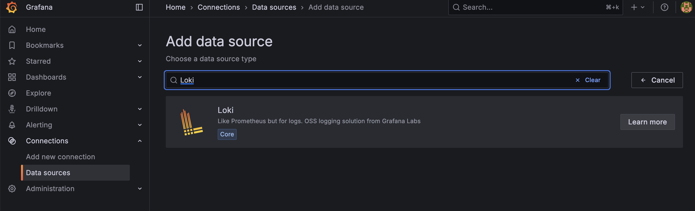
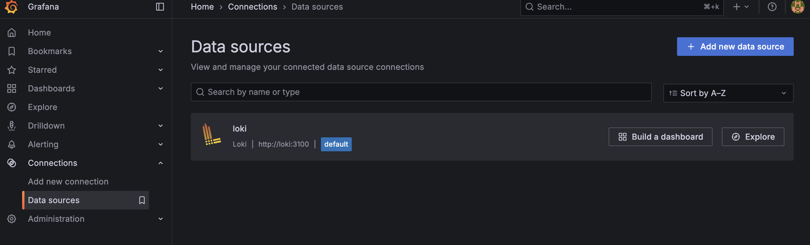
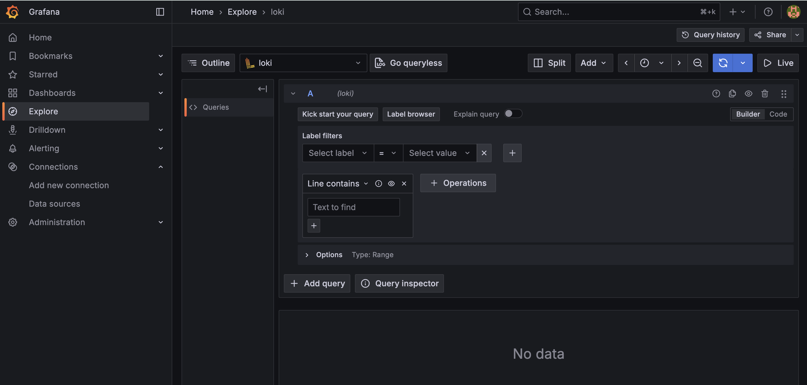
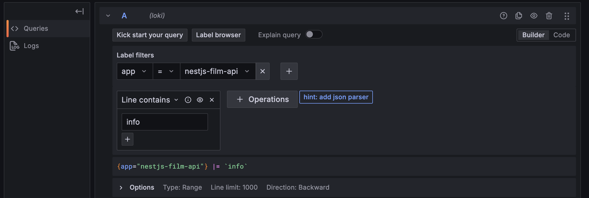
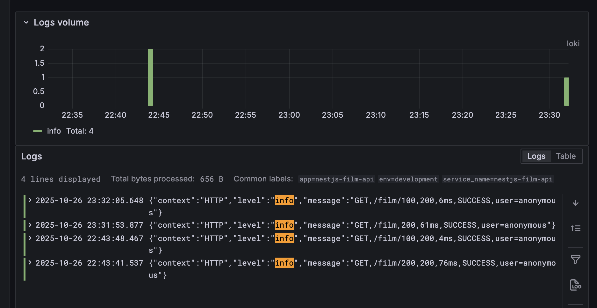

# Báo Cáo Hướng Dẫn Setup Hệ Thống Logging & Monitoring (Winston Logger + Loki + Grafana)

---

# 1. Chuẩn bị Môi trường Docker để chạy Loki & Grafana

## 1.1 File Cấu hình Loki 
File: `loki-config.yml`

```yml
auth_enabled: false
server:
  http_listen_port: 3100
limits_config:
  allow_structured_metadata: false 

ingester:
  lifecycler:
    address: 127.0.0.1
    ring:
      kvstore:
        store: inmemory
      replication_factor: 1
    final_sleep: 0s
  chunk_idle_period: 5m
  wal:
    dir: /tmp/wal

schema_config:
  configs:
    - from: 2020-10-24
      store: boltdb-shipper
      object_store: filesystem
      schema: v11
      index:
        prefix: index_
        period: 24h
storage_config:
  boltdb_shipper:
    active_index_directory: /loki/boltdb-shipper-active
    cache_location: /loki/boltdb-shipper-cache
    cache_ttl: 24h
  filesystem:
    directory: /loki/chunks
compactor:
  working_directory: /loki/boltdb-shipper-compactor
```

## 1.2 File khởi động Docker 
File: `docker-compose.yml` *(đặt cùng thư mục với file `loki-config.yml`)*

File này định nghĩa các service Loki, Grafana và MySQL, đảm bảo chúng nằm trong cùng một mạng.

```yml
networks:
  loki-network:

services:
  loki:
    image: grafana/loki:latest
    container_name: loki
    ports:
      - "3100:3100" 
    command: -config.file=/etc/loki/config.yml
    volumes:
      - ./loki-config.yml:/etc/loki/config.yml
      - loki-data:/loki
    networks:
      - loki-network

  grafana:
    image: grafana/grafana:latest
    container_name: grafana
    ports:
      - "3001:3000" 
    environment:
      - GF_AUTH_ANONYMOUS_ENABLED=true 
      - GF_AUTH_ANONYMOUS_ORG_ROLE=Admin
    volumes:
      - grafana-data:/var/lib/grafana
    networks:
      - loki-network

  db:
    image: nxt964/sakila-mysql:latest
    container_name: mysql_db
    restart: always
    ports:
      - "3306:3306"
    environment:
      MYSQL_ROOT_PASSWORD: rootpassword
      MYSQL_DATABASE: sakila
      MYSQL_USER: user
      MYSQL_PASSWORD: password
    volumes:
      - mysql-data:/var/lib/mysql

volumes:
  loki-data:
  grafana-data:
  mysql-data:
```

## 1.3 Chạy file docker và các services:

- Trong thư mục chứa hai file trên, chạy lệnh sau:

```bash
docker-compose -f docker-compose.yml up -d
```

- Kiểm tra các services đã khởi động chưa, chạy lệnh: 
```bash
docker ps
``` 

=> Phải thấy các container `loki`, `grafana`, và `mysql_db` đều ở trạng thái **Up**.

# 2. Cấu hình Logger trong NestJS (Winston)

## 2.1 Cài đặt Dependencies

```bash
npm install nest-winston winston winston-loki
```

## 2.2 Định nghĩa Logging Interceptor

Sử dụng `Interceptor` để bắt log cho mỗi request HTTP (thành công/thất bại), định dạng chúng thành một chuỗi duy nhất để Loki dễ dàng tiếp nhận.

File: `src/common/interceptors/logging.interceptor.ts`

```typescript
import {
  Injectable,
  NestInterceptor,
  ExecutionContext,
  CallHandler,
  Logger,
  Inject,
} from '@nestjs/common';
import { Observable, tap, catchError, throwError } from 'rxjs';
import { WINSTON_MODULE_NEST_PROVIDER } from 'nest-winston'; 

@Injectable()
export class LoggingInterceptor implements NestInterceptor {
  constructor(
    @Inject(WINSTON_MODULE_NEST_PROVIDER)
    private readonly logger: Logger,
  ) {}

  intercept(context: ExecutionContext, next: CallHandler): Observable<any> {
    const req = context.switchToHttp().getRequest();
    const res = context.switchToHttp().getResponse();

    const { method, originalUrl } = req;
    const user = req.user ? `userId=${req.user.id}` : 'user=anonymous';
    const start = Date.now();

    return next.handle().pipe(
      tap(() => {
        const delay = Date.now() - start;
        // Ghi log thành công
        this.logger.log(
          `${method},${originalUrl},${res.statusCode},${delay}ms,SUCCESS,${user}`,
          'HTTP', 
        );
      }),
      catchError((err) => {
        const delay = Date.now() - start;
        // Ghi log thất bại
        this.logger.error(
          `${method},${originalUrl},${res.statusCode || 500},${delay}ms,FAIL: ${
            err.message
          },${user}`,
          'HTTP',
        );
        return throwError(() => err);
      }),
    );
  }
}
```

## 2.3 Cấu hình AppModule

Thiết lập `WinstonModule` để sử dụng:
- `LokiTransport`, gửi logs dưới định dạng JSON tới cổng 3100 với Labels nhận dạng ứng dụng.
- Ở đây dùng cả `FileTransport` để có thể ghi log ra file định dạng `.csv` để có thể mở xem trong excel

File: `src/app.module.ts`

```typescript
import { Module } from '@nestjs/common';
import { TypeOrmModule } from '@nestjs/typeorm';
import { FilmModule } from './film/film.module';
import { WinstonModule } from 'nest-winston';
import * as winston from 'winston';
import { APP_INTERCEPTOR } from '@nestjs/core';
import { LoggingInterceptor } from './common/interceptors/logging';
import LokiTransport from 'winston-loki';

@Module({
  imports: [
    TypeOrmModule.forRoot({
      // ... cấu hình MySQL đã hướng dẫn ở [README_2]
      type: 'mysql',
      host: 'localhost',
      port: 3306,
      username: 'user',
      password: 'password',
      database: 'sakila',
      entities: [__dirname + '/**/*.entity{.ts,.js}'],
      synchronize: false,
    }),
    WinstonModule.forRoot({
      transports: [
        // ... (Cấu hình File Transport)
        new winston.transports.File({
          dirname: 'logs',
          filename: 'app.log.csv',
          level: 'info',
          maxsize: 20 * 1024 * 1024,
          maxFiles: 1,
          tailable: true,
          format: winston.format.combine(
            winston.format.timestamp({ format: 'YYYY-MM-DD HH:mm:ss' }),
            winston.format.printf(({ timestamp, message }) => {
              return `${timestamp},${message}`;
            }),
          ),
        }),
        // CẤU HÌNH LOKI TRANSPORT
        new LokiTransport({
          host: 'http://localhost:3100', // Loki đang chạy trên host tại cổng 3100
          labels: { app: 'nestjs-film-api', env: process.env.NODE_ENV || 'development' },
          json: true,
          format: winston.format.json(), // Log dưới dạng JSON để Loki phân tích
          level: 'info', 
        }),
      ],
    }),
    FilmModule,
  ],
  controllers: [],
  providers: [
    {
      provide: APP_INTERCEPTOR,
      useClass: LoggingInterceptor,
    },
  ],
})
export class AppModule {}
```

# 3. Hướng dẫn Xem và Phân tích Logs trên Grafana

## 3.1 Truy cập Grafana

- Mở trình duyệt và truy cập: http://localhost:3001 (Cổng Grafana đã được map).

- Vì đã bật `GF_AUTH_ANONYMOUS_ENABLED=true` nên có thể truy cập ngay. 

- Hoặc nếu trình duyệt có yêu cầu đăng nhập thì nhập account mặc định:
    - **usename**: `admin`
    - **password**: `admin`

## 3.2 Thiết lập Data Source (Chỉ làm lần đầu)

1. Trong Grafana, điều hướng đến Connections $\rightarrow$ Data sources.

2. Click `Add new data source` và chọn `Loki`.



3. Trong trường HTTP URL, nhập địa chỉ của Loki: http://loki:3100 

(Sử dụng tên service loki là cách đáng tin cậy nhất trong môi trường Docker Compose).

4. Click `Save & test`.

*Sau khi kết nối thành công. Giao diện sẽ hiện ra như sau:*


## 3.3 Xem Logs trong Explore

1. Điều hướng đến tab Explore.

2. Đảm bảo đã chọn Data Source là Loki đã connect trước đó.



3. Sử dụng cú pháp LogQL để truy vấn logs:

- **Bước 1**: Lọc logs theo Label (Bắt buộc)
Nhập truy vấn để tìm tất cả logs từ ứng dụng dựa trên label app đã định nghĩa trong `AppModule`: 
    - `{app="nestjs-film-api"}`

- **Bước 2**: Lọc theo Nội dung (Tùy chọn)
Để tìm kiếm sâu hơn, ví dụ: tìm tất cả các log có level `info`:
    - `{app="nestjs-film-api"} |= "info"`
    - `|=` là toán tử tìm kiếm chuỗi (string) trong nội dung log.



- **Bước 3**: Click `Run query`. Logs từ NestJS sẽ được hiển thị, cho phép phân tích thời gian phản hồi, trạng thái và lỗi của API,...

